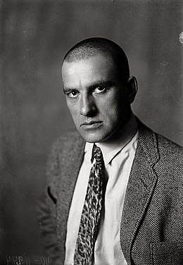

# Маяковский
Я построила карту по [стихотворению] (https://poemata.ru/poets/mayakovskiy-vladimir/prochti-i-katay-v-parizh-i-v-kitay/) **Владимира Маяковского**.В нем он рассказывает про посещение *Франции, Америки, Японии и Китая*.

